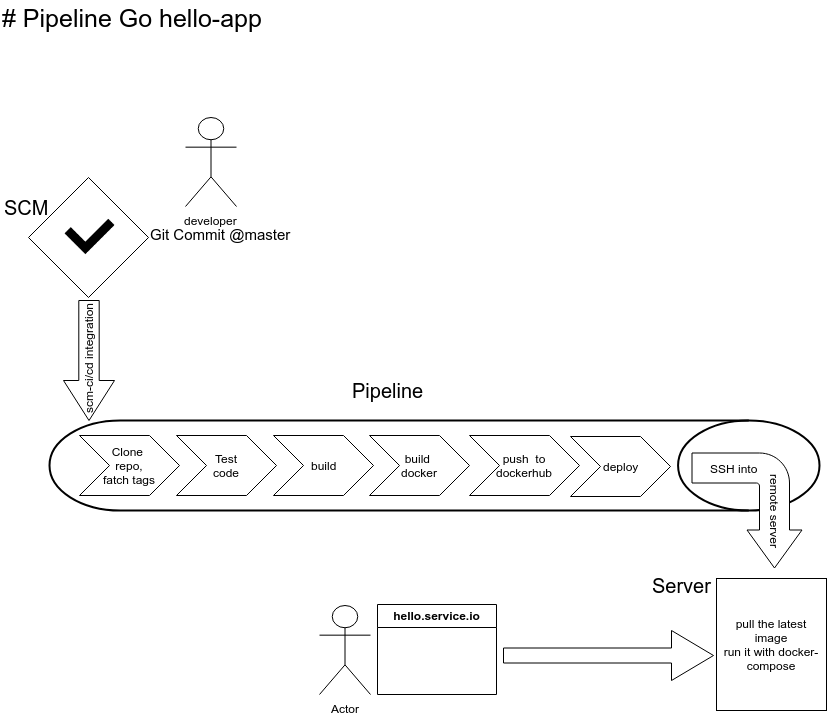

# hello app pipeline in golang. 
## commit->test->build->pack-into-container->shipe-container-to-remote->deploy->access-live app.

# pipeline arch

## setup
> for infra run git+drone @[docker-compose-cicd](http://github.com/skjoher/docker-compose-cicd)
    
- edit .drone.yml
- @line 26 > repo: localcontainer/hello change the repo name 
- add drone secret - docker_username, docker_password, ssh_username, ssh_password
- @line 39 > host: 172.17.0.1 . this is setup 'll deploy in local dev machine (change it for remote host)
- @line 46 change it your repo address.